# 📸 AI-Powered Event Photo Management System
*A minimal-code, cost-optimized batch processing solution*

---

## 🎯 Goal
Automate the **recognition, classification, grouping, enhancement, and metadata generation** of large-scale event or graduation photos using **batch processing**, minimizing manual effort and reducing infrastructure cost.

---

## 🔁 System Architecture – Batch Processing

```mermaid
flowchart TD
    A@{shape: manual-file, label: "Bulk Upload Folder/ZIP to S3"} --> B@{shape: trap-t, label: "Batch Trigger(Manual or Scheduled)"}
    B --> C@{shape: rounded, label: "AWS Batch/EKS Job"}
    C --> D@{shape: procs, label: "Lambda Workers → Rekognition Face & Attribute Analysis"}
    D --> E@{shape: proc, label: "Clustering & Identification (Rekognition DetectFaces API, and Collection APIs)"}
    E --> G@{shape: proc, label: "Metadata Tagging (GPT, DeepSeek)"}
    G --> H@{shape: cylinder, label: "Results Stored in DynamoDB"}
    H --> I@{shape: stadium, label: "User Reviews & Exports via GUI"}
```



---

## 💡 Batch Processing Strategy

| Component | Cost-Optimized Approach |
|-----------|-------------------------|
| Processing | **AWS Batch / ECS / EKS with Spot Instances** |
| Trigger | **Scheduled Lambda (cron)** or manual trigger from GUI |
| AI Recognition | **AWS Rekognition Batch API** |
| Storage | S3 with lifecycle archive rules |
| Enhancement | Cloudinary AI or Lambda + Pillow |
| Metadata | **Only after grouping**, minimizing API calls |

---

## 🧠 AI & Vision Features

| Feature | Technology |
|--------|------------|
| Face Detection & Matching | AWS Rekognition |
| Person Grouping | AWS Rekognition Collection API |
| Facial Expression | Rekognition |
| Background Brightness | Rekognition |
| Metadata/Captions | GPT, DeepSeek |
| Enhancement/Layout Cropping | Cloudinary or Pillow (Lambda) |

---

## 🏗️ Tech Stack Overview

| Area | Tools |
|------|------|
| Storage | **Amazon S3** |
| Compute | **AWS Batch (Fargate/EKS)** |
| Face Recognition | AWS Rekognition |
| Metadata AI | GPT / DeepSeek / InterVL |
| Orchestration | Lambda (scheduled / manual), Step Functions (optional) |
| Database | DynamoDB (or Firebase alternative) |
| Enhancement | Cloudinary AI / Pillow |
| GUI | Streamlit (fastest), AWS Amplify, or Electron Desktop |

---

## 🔥 Full Workflow Breakdown

```yaml
1. Upload ZIP or folder of images to S3.
2. Batch job triggered via:
   - Scheduled Lambda (cron-based), OR
   - Manual trigger from GUI/CLI.
3. Each Batch job:
   a. Call Rekognition Batch → detect faces, attributes.
   b. Extract facial feature embeddings.
   c. Cluster images per person.
   d. Call GPT/DeepSeek/InterVL once per cluster to generate metadata tags.
   e. Enhance image using Cloudinary or Pillow.
   f. Save photo + metadata to DynamoDB.
4. Notify GUI system.
5. User reviews final grouped folders and exports.
```

---

## 📦 Final Output Structure

```bash
/final_output/
   person_001/
       img001.jpg
       img045.jpg
       metadata.json
   person_002/
       img010.jpg
       img022.jpg
       metadata.json
summary.csv    # Summary showing count of photos per person
```

---

## 📊 AWS Batch Job Definition Example

```yaml
jobDefinitionName: photo-processing-job
type: container
platformCapabilities:
  - FARGATE
containerProperties:
  image: <ECR_CONTAINER_IMAGE>
  vcpus: 1
  memory: 2048
  command: ["python", "process_batch.py"]
retryStrategy:
  attempts: 1
timeout:
  attemptDurationSeconds: 3600
```

## 💰 Cost Optimization Techniques

| Optimization | How |
|--------------|-----|
| Compute | Use **AWS Batch Spot Instances** |
| API Costs | Group photos first → use LLM only per cluster |
| Storage | Archive raw images using S3 Glacier |
| Processing | Parallel local multiprocessing in batch job container |
| Rekognition | Use RecentFaces caching to reduce calls |

---

## 🔐 Security & Compliance

| Area | Strategy |
|------|----------|
| IAM | Restrict Rekognition, S3, Batch, and Lambda to required scopes |
| Data Residency | Process within same region |
| Access | Signed S3 URLs |
| Monitoring | CloudWatch logs & metrics |
| Auto Cleanup | S3 lifecycle policy for archival/deletion |

---

## 🎯 Final Summary

> Use **AWS Batch + S3 + Rekognition** to process event photos in inexpensive, parallel batches.  
> Cluster images to minimize AI calls → Use **LLMs (GPT, DeepSeek, InterVL)** only once per group.  
> Enhance images via **Cloudinary** or Pillow.  
> Provide a **low-code GUI** using Streamlit for easy review/export.  
> Maximize savings using **Spot Instances** and **scheduled batch operations** (not real-time).
